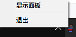

## 定时喝水提醒

身体才是革命的本钱，做一个喝水提醒工具。

#### Build 执行

```shell
pyinstaller -i .\images\icon.ico  --onefile Water.py --name Water
pyinstaller -i .\images\icon.ico  --onefile Run.py --name Run
```

```shell
pyinstaller Water.spec
pyinstaller Run.spec
```

##### Option
```shell
--noconsole -i .\images\icon.ico --add-data "images/*;images"
```

#### 展示



